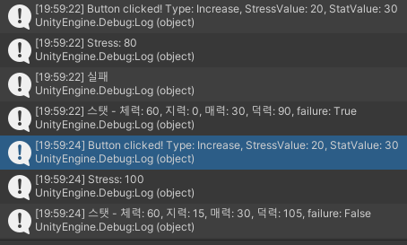

이전 개발 과정에 이어 버튼 시스템을 어느정도 완료하기까지 두 단계가 남았다.  

1. 스트레스 수치에 따라 활동 성패 여부 결정
2. 실패/성공/대성공 결과따라 얻는 스탯 수치를 다르게 적용  

오늘은 이 중에서 1번을 구현해보자.  

## 스트레스 수치에 따라 활동 성패 여부 결정  
---
스트레스 수치에 따라 일정 수치 이상일 때는 대실패 확률이 올라가는 기능을 구현해보자.  
예시로 스트레스가 70 이상일 때, 대실패 확률이 10% 상승하며, 스탯 획득량이 50% 감소한다고 가정하자.  

---
### Random.value  
Unity에서 제공하는 Random.value 프로퍼티를 사용하면 쉽게 구현할 수 있다.
> Random.value : 0.0 이상 1.0 미만의 랜덤한 값을 반환한다.  


**수정 전 코드**
```csharp
if (stressValue >= 70) { // 스트레스가 70 이상이라면
            if (Random.value < 0.1f) { // 10% 확률로 실패
                isFailure = true;
            }
            statValue *= 1/2; // 스탯 값 상승량 절반
        }
```
이렇게 코드를 잤더니, 10% 확률로 실패가 결정되긴 했지만, 스트레스가 70 이상일 때는 성공해도 스탯 값이 상승하지 않는 문제가 있었다.  
이유는 ```statValue *= 1/2;``` 때문이었다. 
statValue가 int형이었다. C#에서는 정수 나눗셈을 할 때 1/2는 0이 된다고 한다. 그래서 statValue가 0이 되어 증가하지 않던 것이다.  

**수정한 코드**
```csharp
if (stressValue >= 70) { // 스트레스가 70 이상이라면
            if (Random.value < 0.1f) { // 10% 확률로 실패
                isFailure = true;
            }
            statValue /= 2; // 스탯 값 상승량 절반
        }
```
2를 나누는 코드로 바꾸니, 문제가 해결되었다. 그리고 스탯 상승 코드에 if문으로 !isFailure 조건을 추가해 감싸주니 실패하지 않았을 때만 스탯이 상승하는 코드가 완성되었다.  

다음에는 2번을 구현해보자.